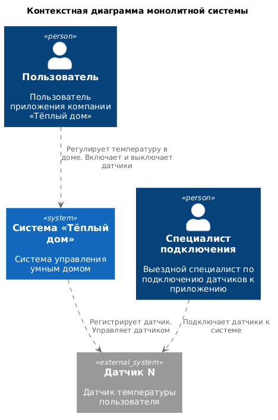
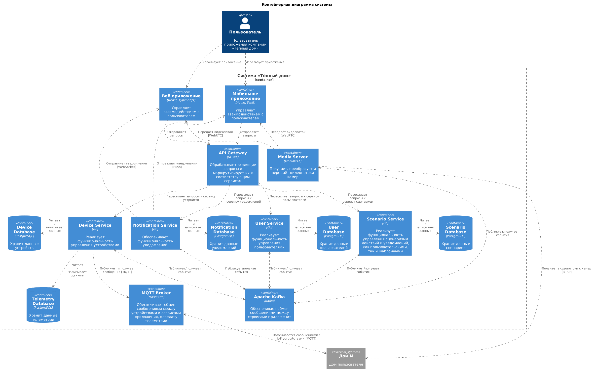
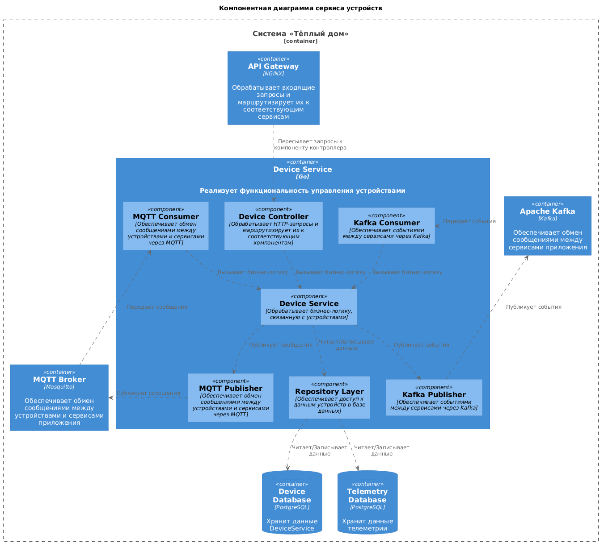
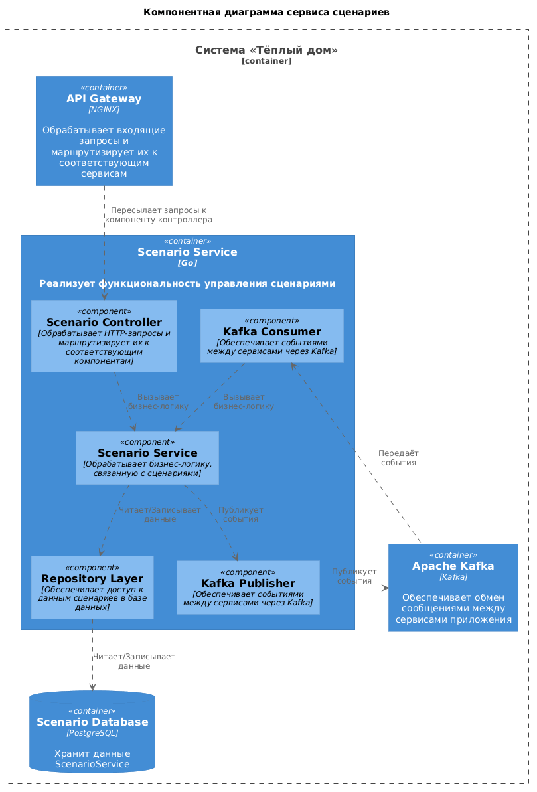
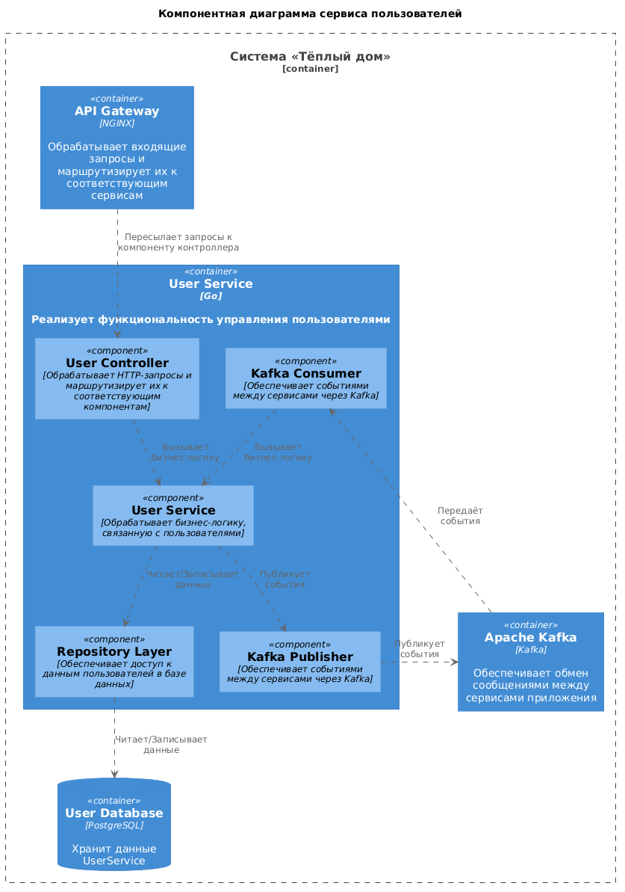
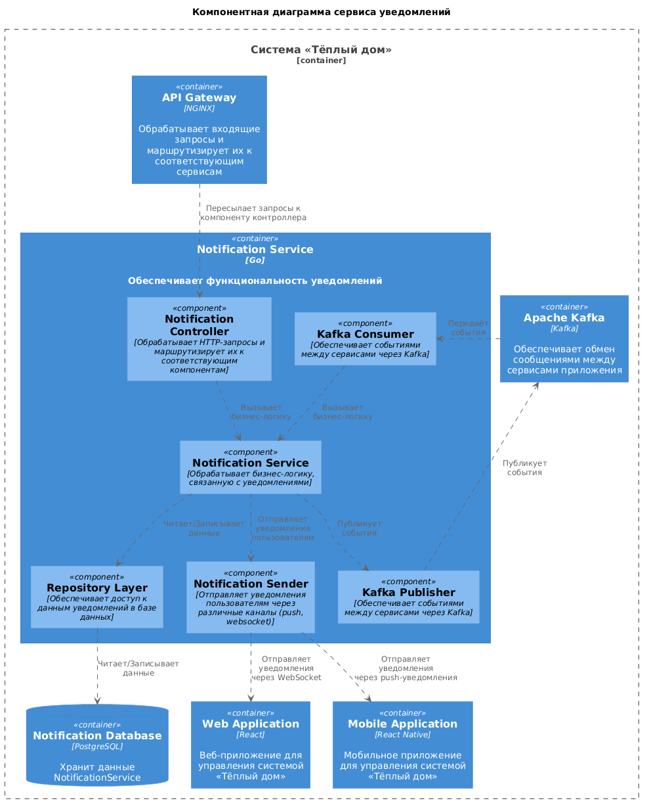

# Использование ChatGPT

- команды git
- донастройка CI/CD для отрисовки UML диаграмм

# Задание 1. Анализ и планирование

### 1. Описание функциональности монолитного приложения

**Управление отоплением:**

- Пользователи могут управлять отоплением (включение/отключение)
- Система управляет системой отопления на основе команд пользователей

**Мониторинг температуры:**

- Пользователи могут проверять температуру
- Система управляет датчиками, запрашивает информацию по температуре

**Управление датчиками:**

- Пользователи ***не могут*** провести самостоятельное подключение
- Система может:
  - регистрировать датчики (при их включении)
  - удалять датчики
  - изменять состояние датчиков (изменение температуры)
  - получать информацию по темипературе от датчика
  - получать список всех датчиков
  - получать датчик по ID

### 2. Анализ архитектуры монолитного приложения

**Архитектура** - монолитная

**Язык программирования** - Go (образ - golang:1.22-alpine)

**База данных** - PostgreSQL (образ - postgres:16-alpine)

**Требования для развертывания** - Docker и Docker Compose

**Особенности:**

- Отсутствует возможность самостоятельного подключения датчиков к системе
- Только синхронные вызовы (взаимодействие через REST API)
- Все запросы идут от сервера к датчику

### 3. Определение доменов и границы контекстов

**Домены для текущей системы:**

- Домен: управление датчиками
  - поддомен: управление датчиками
    - контекст: регистрация и удаление датчиков
    - контекст: изменение датчиков
	- контекст: получение данных датчиков

**Домены для целевой экосистемы:**

- Домен: управление датчиками
  - поддомен: управление датчиками
    - контекст: регистрация и удаление датчиков
    - контекст: изменение датчиков
	- контекст: получение данных датчиков
- Домен: управление камерами
  - поддомен: управление камерами
    - контекст: регистрация и удаление камер
	- контекст: изменение камер
	- контекст: получение видео-трансляции с камер
- Домен: управление пользователями
  - поддомен: управление пользователями
    - контекст: регистрация и удаление пользователей
	- контекст: авторизация пользователей
	- контекст: изменение пользователей
- Домен: управление сценариями
  - поддомен: управление сценариями
    - контекст: создание и удаление сценариев
	- контекст: изменение сценариев
	- контекст: запуск сценариев
- Домен: администрирование

### **4. Проблемы монолитного решения**

- Ошибка сервиса вызывает остановку всего приложения - снижение времени доступности
- Обновление системы требует ее полной остановки и перезапуска - снижение времени доступности, высокий риск сбоев при внесении изменений
- Проблемы с масштабированием - при увеличении нагрузки масштабируется все приложение целиком
- Отсутствует реактивное взаимодействие - повышенная зависимость компонентов, повышенные риски сбоя 
- Недостаточный функционал - несоответствие целевому состоянию
- Необходимость выезда специалиста для регистрации датчиков - снижение доступности и увеличение времени получения доступа к приложению
- Все компоненты работают в одной технологической среде - отсутствие гибкости
- Трудно вносить изменения - увеличение времени разработки нового функционала


### 5. Визуализация контекста системы — диаграмма С4

Добавьте сюда диаграмму контекста в модели C4.

Чтобы добавить ссылку в файл Readme.md, нужно использовать синтаксис Markdown. Это делают так:

[Контекстная диаграмма монолитной системы](diagrams/context/context.puml)




# Задание 2. Проектирование микросервисной архитектуры

В этом задании вам нужно предоставить только диаграммы в модели C4. Мы не просим вас отдельно описывать получившиеся микросервисы и то, как вы определили взаимодействия между компонентами To-Be системы. Если вы правильно подготовите диаграммы C4, они и так это покажут.

**Диаграмма контейнеров (Containers)**

[Контекстная диаграмма системы](diagrams/container/container.puml)



## Диаграмма компонентов (Components)

### 1. Device Service

[Компонентная диаграмма Device Service](diagrams/component/component-DeviceService.puml)


### 2. Scenario Service

[Компонентная диаграмма Scenario Service](diagrams/component/component-ScenarioService.puml)


### 3. User Service

[Компонентная диаграмма User Service](diagrams/component/component-UserService.puml)


### 4. Notification Service

[Компонентная диаграмма Notification Service](diagrams/component/component-NotificationService.puml)


## Диаграмма кода (Code)

Добавьте одну диаграмму или несколько.

# Задание 3. Разработка ER-диаграммы

Добавьте сюда ER-диаграмму. Она должна отражать ключевые сущности системы, их атрибуты и тип связей между ними.

# Задание 4. Создание и документирование API

### 1. Тип API

Укажите, какой тип API вы будете использовать для взаимодействия микросервисов. Объясните своё решение.

### 2. Документация API

Здесь приложите ссылки на документацию API для микросервисов, которые вы спроектировали в первой части проектной работы. Для документирования используйте Swagger/OpenAPI или AsyncAPI.

# Задание 5. Работа с docker и docker-compose

Перейдите в apps.

Там находится приложение-монолит для работы с датчиками температуры. В README.md описано как запустить решение.

Вам нужно:

1) сделать простое приложение temperature-api на любом удобном для вас языке программирования, которое при запросе /temperature?location= будет отдавать рандомное значение температуры.

Locations - название комнаты, sensorId - идентификатор названия комнаты

```
	// If no location is provided, use a default based on sensor ID
	if location == "" {
		switch sensorID {
		case "1":
			location = "Living Room"
		case "2":
			location = "Bedroom"
		case "3":
			location = "Kitchen"
		default:
			location = "Unknown"
		}
	}

	// If no sensor ID is provided, generate one based on location
	if sensorID == "" {
		switch location {
		case "Living Room":
			sensorID = "1"
		case "Bedroom":
			sensorID = "2"
		case "Kitchen":
			sensorID = "3"
		default:
			sensorID = "0"
		}
	}
```

2) Приложение следует упаковать в Docker и добавить в docker-compose. Порт по умолчанию должен быть 8081

3) Кроме того для smart_home приложения требуется база данных - добавьте в docker-compose файл настройки для запуска postgres с указанием скрипта инициализации ./smart_home/init.sql

Для проверки можно использовать Postman коллекцию smarthome-api.postman_collection.json и вызвать:

- Create Sensor
- Get All Sensors

Должно при каждом вызове отображаться разное значение температуры

Ревьюер будет проверять точно так же.


